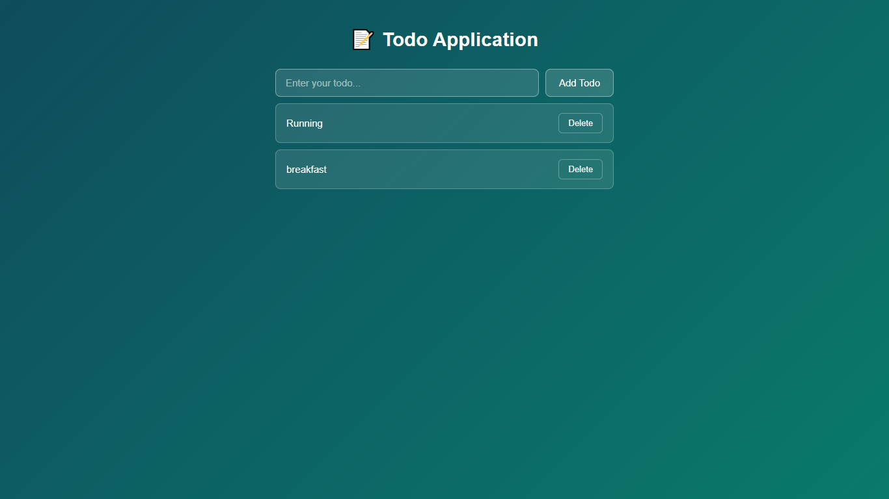
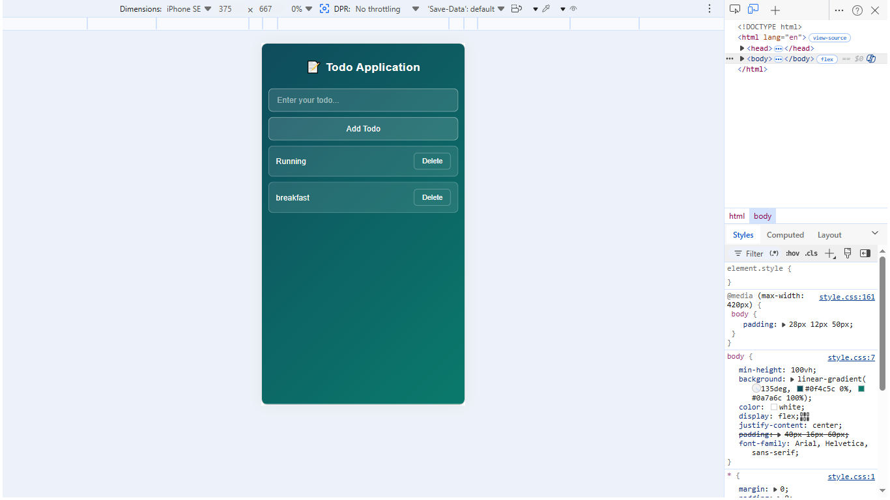

# 📝 Todo App — Vanilla JavaScript

A clean, fully responsive Todo application built with pure **HTML**, **CSS**, and **JavaScript** — no frameworks or libraries required. Tasks persist across browser sessions using the **localStorage API**.

---

## 🚀 Live Features

- ✅ Add todos with the form or by pressing `Enter`
- 🗑️ Delete individual todos
- 💾 Todos saved in `localStorage` — survive page refresh
- ⚠️ Duplicate detection with user-facing warning
- 📭 Empty-state message when the list is empty
- 📱 Fully responsive — works on mobile, tablet & desktop
- 🔒 XSS-safe input handling via `textContent`

---

## 📁 Project Structure

```
todo_project/
├── index.html        # Main HTML file
├── logo.jpg          # App favicon
|── ScreenShot/
        └── Desktop View
        └── Mobile View
├── CSS/
│   └── style.css     # All styles + responsive breakpoints
└── JS/
    └── index.js      # App logic (add, delete, persist todos)
```

---

## 🛠️ How to Run

No build step or server required.

1. Clone or download this repository
2. Open `index.html` in any modern browser

```bash
git clone https://github.com/asifn0093/todo-app.git
cd todo-app
# Open index.html in your browser
```

---

## 🧠 JavaScript Concepts Used

| Concept | Where Used |
|---|---|
| DOM manipulation | Creating & removing todo elements |
| Event delegation | Single listener handles all delete buttons |
| `localStorage` API | Persisting todos across sessions |
| Form handling & validation | Preventing empty or duplicate todos |
| Array methods (`filter`, `includes`) | Managing the todo list |
| `textContent` vs `innerHTML` | XSS-safe rendering |

---

## 📸 Screenshots

## 📸 Screenshots




---

## 📱 Responsive Design

| Screen | Behaviour |
|---|---|
| Desktop (> 420px) | Form in a single row |
| Mobile (≤ 420px) | Input and button stack vertically |

---

## 🐛 Known Limitations

- Todos are stored locally per browser — not synced across devices
- No editing of existing todos (planned for a future update)

---

## 🔮 Future Improvements

- [ ] Edit existing todos inline
- [ ] Mark todos as complete
- [ ] Filter by status (All / Active / Completed)
- [ ] Drag-and-drop reordering
- [ ] Backend sync / user accounts

---

## 👤 Author

**Asif Nawaz**
- GitHub: [@asifn0093](https://github.com/asifn0093)

---

## 📄 License

This project is open source and available under the [MIT License](LICENSE).